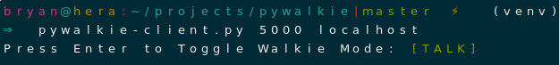
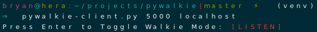
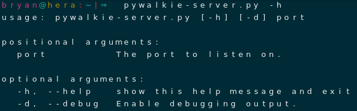
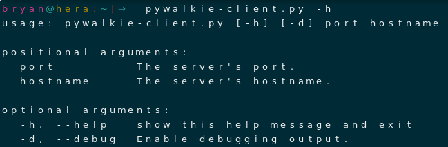

# What is Pywalkie?
A two-way walkie-talkie command-line application. The server should run daemonize the `pywalkie-server.py` script, at which point you can start a conversation from some other client machine. The client machine has full control over the flow of the conversation.

# Usage
The two screenshots below were taken from the viewpoint of the client. The client uses the `Enter` key to toggle control of the communication between the two machines.

# Documentation

